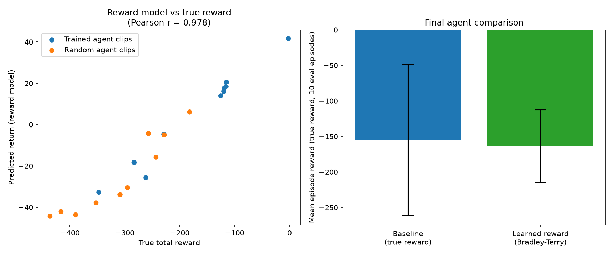
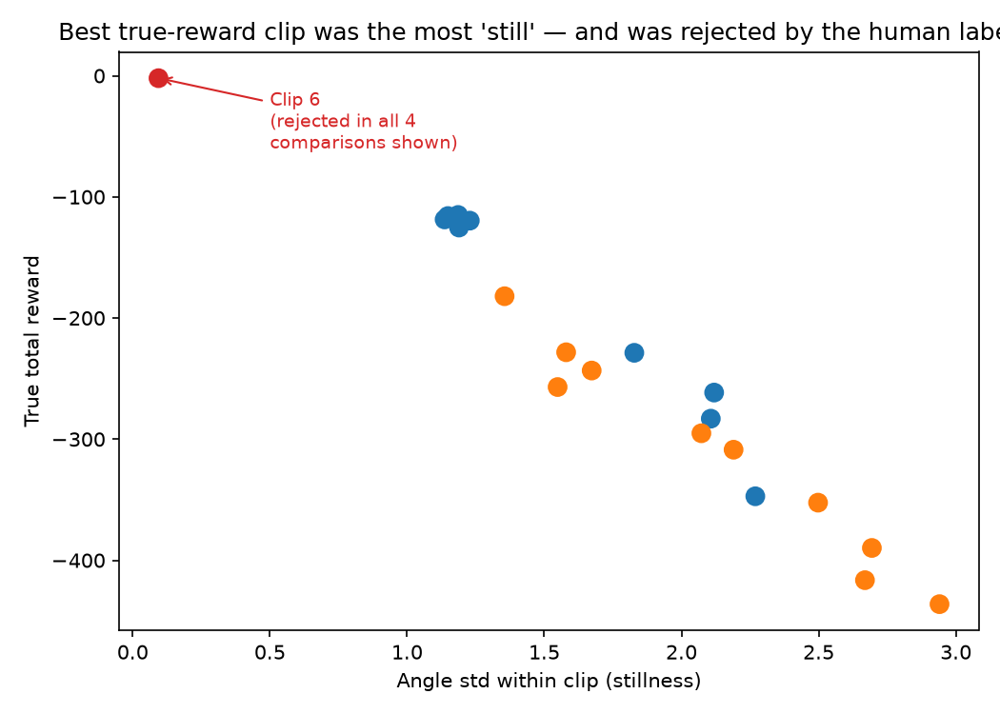

# Preference-Based Reward Learning on Pendulum

A simplified implementation of preference-based reinforcement learning, inspired by
**PEBBLE** (Lee et al., 2021) and the broader RLHF literature. Instead of training an
agent with the environment's true reward, this project learns a reward function from
pairwise preferences between trajectory segments, then trains a policy using only that
learned reward — and checks whether it performs comparably to a policy trained on the
true reward.

> **Note on scope:** This is a small-scale, self-contained reproduction of PEBBLE's core
> idea (reward learning from preferences), not a full reproduction of the original paper.
> It omits PEBBLE's unsupervised exploration pre-training and uses a scripted oracle in
> place of human labels for the initial experiments (see [Limitations](#limitations)).

## Motivation

In many real-world tasks, writing down a reward function by hand is hard — "helpful",
"safe", or "natural" behavior doesn't reduce to a simple formula. RLHF-style methods
sidestep this by learning reward from comparisons instead: show two behaviors, ask which
is better, and fit a reward model to those judgments. This project implements that loop
end-to-end on a small continuous-control task to understand the mechanism concretely.

## Method

**Environment:** `Pendulum-v1` (Gymnasium), continuous control, true reward is a smooth
function of the pole's angle and angular velocity.

**Pipeline:**
1. Train a baseline SAC agent on the true reward (Stable-Baselines3).
2. Collect short trajectory clips from both the trained agent and a random policy, to get
   a spread of clip quality.
3. Generate pairwise preference labels between clips (currently: a scripted oracle based
   on true return, standing in for a human labeler).
4. Train a reward model on these preferences using the Bradley-Terry model.
5. Train a **new** SAC agent using only the learned reward (it never sees the true reward
   during training).
6. Evaluate both agents on the environment's true reward for a fair comparison.

**Bradley-Terry model.** Given two clip segments A and B with predicted returns $R_A$ and
$R_B$ from the reward model, the probability that A is preferred over B is modeled as:

$$P(A \succ B) = \sigma(R_A - R_B) = \frac{1}{1 + e^{-(R_A - R_B)}}$$

The reward model is trained by minimizing binary cross-entropy between this predicted
probability and the observed preference label, using `BCEWithLogitsLoss` with
`R_A - R_B` as the logit.

## Results

**Reward model recovers the true reward ranking from preferences alone.**

The reward model never observes the true scalar reward directly — only which clip was
preferred in each of 100 pairwise comparisons. Despite this, its predicted returns
correlate strongly with the true total reward per clip:

**Pearson r = 0.978**



*Left: predicted return vs. true reward for each clip, colored by source (trained vs.
random policy). Right: final agent comparison — mean episode reward over 10 evaluation
episodes, using the environment's true reward in both cases.*

**Agent trained on learned reward performs comparably to the baseline.**

| Agent | Mean reward (true, 10 episodes) |
|---|---|
| Baseline (trained on true reward) | -155.01 ± 106.29 |
| Learned reward (Bradley-Terry) | -163.62 ± 50.99 |

The two agents' performance is statistically indistinguishable given the overlapping
error bars — the agent trained purely on preference-derived reward reaches similar
performance to one trained on the ground-truth reward.


## Finding: a systematic human labeling bias

Analyzing disagreements between human labels and the ground-truth reward ranking
revealed a striking, non-random pattern: **the single best-performing clip by true
reward (angle std = 0.094, more than 12x lower than any other clip) was rejected in
every comparison it appeared in** (4/4), regardless of whether it was shown as option
A or B — ruling out simple position bias.



This clip corresponds to near-perfect pole stabilization: the pendulum stays almost
motionless near upright. It appears the human labeler (myself) associated visible
movement with "active control" and stillness with passivity — even though stillness
near the target is exactly what optimal control looks like here.

This is a small-scale illustration of a real challenge in preference-based RL and
RLHF more broadly: **visually salient behavior is not always reward-optimal behavior**,
and human labelers can introduce systematic (not just random) bias into the reward
signal. It's part of why methods like PEBBLE pair preference learning with careful
segment selection and presentation.


## Limitations

- **Scripted oracle, not human labels.** Preferences are currently generated from true
  reward comparisons rather than real human judgment. This validates the learning
  mechanism but doesn't yet test robustness to noisy or inconsistent human feedback.
- **Small scale.** 20 clips, 100 preference pairs, single environment. PEBBLE's original
  results are on harder continuous-control benchmarks with thousands of queries.
- **No unsupervised pre-training.** PEBBLE uses an entropy-based exploration phase before
  preference collection to improve clip diversity; this project skips that step.
- **Single seed.** Results are from one training run per condition, not averaged across
  multiple seeds — variance across seeds is unmeasured.

## Repository structure

```
preference-rl-project/
├── test.py                        # environment sanity check
├── q_learning.py                  # tabular Q-learning on FrozenLake (fundamentals)
├── train_pendulum.py              # baseline SAC agent, trained on true reward
├── extract_clips.py               # collect trajectory clips from trained + random policies
├── generate_preferences.py        # scripted oracle: pairwise preference labels
├── reward_model.py                # Bradley-Terry reward model training
├── train_with_learned_reward.py   # train new agent on learned reward, compare to baseline
├── plot_results.py                # generate results_comparison.png
└── results_comparison.png
```

## Running it

```bash
pip install gymnasium torch numpy matplotlib stable-baselines3

python train_pendulum.py              # baseline agent
python extract_clips.py               # collect clips
python generate_preferences.py        # generate preference pairs
python reward_model.py                # train reward model
python train_with_learned_reward.py   # train + compare
python plot_results.py                # generate figure
```

## Acknowledgments

Inspired by **PEBBLE: Feedback-Efficient Interactive Reinforcement Learning via
Relabeling Experience and Unsupervised Pre-training** (Lee, Smith & Abbeel, ICML 2021),
and by the broader RLHF literature this idea underpins.
